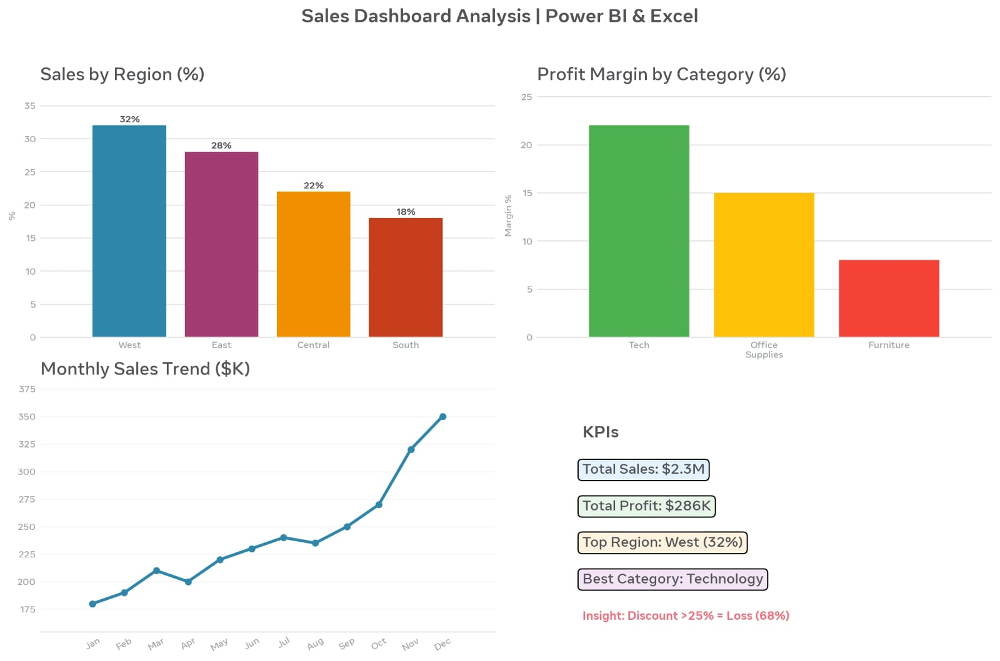

# 🛒 Sales Dashboard Analysis | Excel & Power BI

## 📌 Project Overview
Analyzed Superstore sales data (5000+ records) to identify profit trends, top regions, and product performance. Built an interactive dashboard for business insights.

## 🎯 Objectives
- Clean and analyze sales data using Excel
- Identify top performing regions, categories & segments
- Find reasons for profit loss
- Build Power BI dashboard

## 📊 Key Insights
- **Total Sales:** $2.3M | **Total Profit:** $286K
- **West Region** - Highest sales (32% of total)
- **Technology Category** - Highest profit margin (22%)
- **Discount > 25%** - Causes loss in 68% of transactions
- **Consumer Segment** - Most valuable customers
- **Q4 (Nov-Dec)** - Peak sales season

## 🛠️ Tools & Techniques Used
- Excel: Power Query, Pivot Tables, VLOOKUP
- Power BI: KPI Cards, Bar Charts, Line Charts, Slicers
- Data Cleaning, EDA, Business Recommendations

## 💡 Business Recommendations
1. Reduce discounts on Furniture category
2. Focus marketing on West & East regions
3. Discontinue loss-making sub-category (Tables)
4. Launch loyalty program for Consumer segment

## 👩‍💻 Author
Sripadam Naga Satya Sri Lakshmi | Aspiring Data Analyst
Skills: Excel, Power BI, Python, SQL

## 📈 Dashboard Screenshot

## 👩‍💻 Author
Sripadam Naga Satya Sri Lakshmi | Aspiring Data Analyst
